# 🎬 AI Video Highlight Generator — HighlightAI

An end-to-end AI video intelligence pipeline that automatically transforms long-form video into a polished, captioned highlight reel — combining **ResNet-18** visual scoring, **CLIP** semantic understanding, and **OpenAI Whisper** speech transcription behind a purpose-built **Streamlit** web interface (HighlightAI).

---

## 📌 Overview

Manually scrubbing through long recordings to find the moments worth keeping is slow and repetitive — whether it's a lecture, a match, a press conference, or raw footage. This project automates that process end-to-end: it extracts frames from a source video, scores each one using a dual-model approach (low-level visual richness + high-level semantic relevance), selects the strongest frame per second, transcribes the accompanying audio, and renders a captioned highlight clip — with no manual editing required.

The project has two layers:

- **The AI pipeline** (`run.py` + `src/`) — the actual computer vision, NLP, and video-processing logic. This is the functional core and is untouched by the UI layer.
- **HighlightAI** (`app.py`) — a Streamlit-based visual interface built on top of the pipeline, giving the tool a polished, product-style front end for uploading a video, configuring the AI models, watching the pipeline run, and reviewing/downloading the result.

---

## ✨ Key Features

**AI Pipeline**
- Dual-model frame scoring — combines ResNet-18 visual-richness features with CLIP image–text semantic similarity
- Per-second temporal frame selection, ensuring even coverage across the source video
- Automatic speech transcription and caption alignment via OpenAI Whisper
- Caption overlay rendering with a legibility-optimized text bar
- Contrast/brightness enhancement pass on the final render
- Automatic CUDA detection with CPU fallback
- Fully configurable via `config.yaml` (models, scoring weights, FPS, caption styling)
- Intermediate file cleanup after each run

**HighlightAI Streamlit Interface**
- Branded landing page with hero messaging, technology badges, and dual call-to-action buttons
- Visual AI pipeline diagram (Video → Vision AI → Semantic AI → Speech AI → Highlight Reel)
- Drag-and-drop video upload with format guidance (MP4, AVI, MOV, MKV)
- Uploaded-video preview with metadata: filename, duration, resolution, FPS, and file size
- AI Configuration panel — Whisper model, CLIP model, frame sampling FPS, and a visual ResNet/CLIP scoring-balance bar
- Advanced Settings (max highlight duration, caption font size)
- Live processing dashboard with an animated progress ring and a two-column pipeline status grid covering all six pipeline stages
- Final highlight preview with a one-click download button
- Run summary (durations, model choices, frame counts where available)
- Original-vs-AI-Highlight side-by-side video comparison
- "AI Analysis Summary" section explaining what each model contributed
- "Create Another Highlight" reset flow
- Responsive layout with custom CSS styled around Streamlit's native widgets

---

## 🖥️ Streamlit Web Interface

`app.py` is a **visual layer only** — it calls the existing `run(cfg)` entry point from `run.py` and does not reimplement or alter any pipeline logic. It uses `inspect.signature(run)` to detect whether `run.py` exposes an optional `progress_callback` argument; if so, the UI renders live per-stage progress, and otherwise it falls back to a general processing state.

### Landing page

The landing page introduces the tool with a hero headline, a short description, technology badges (PyTorch, ResNet-18, CLIP, Whisper, OpenCV), and two call-to-action buttons that scroll the user down to the upload workspace.

### Pipeline visualization and configuration workspace

Below the hero, a horizontal pipeline diagram illustrates the five conceptual stages of the system (Video → Vision AI → Semantic AI → Speech AI → Highlight Reel). Underneath, the workspace is split into an upload/preview area on the left and an AI Configuration panel on the right, where the user selects the Whisper model, CLIP model, frame sampling FPS, and the ResNet/CLIP scoring balance.

### AI analysis summary and footer

After a highlight is generated (or while browsing the page), an "AI Analysis Summary" section explains — in plain language — what each model contributes to the final result: visual intelligence (ResNet-18), semantic understanding (CLIP), speech transcription (Whisper), and smart rendering (final assembly). The footer lists the technologies used and links to supporting resources.

### Workflow inside the UI

1. Upload a video (`.mp4`, `.avi`, `.mov`, `.mkv`) via the drag-and-drop zone.
2. Review the auto-extracted metadata (filename, duration, resolution, FPS, size) in the preview card.
3. Adjust the AI Configuration panel: Whisper model size, CLIP model variant, frame sampling FPS, and the ResNet/CLIP scoring balance. Optional Advanced Settings expose max highlight duration and caption font size.
4. Click **Generate AI Highlight** to launch the pipeline. A processing dashboard shows a live progress ring alongside a six-stage status grid (Extracting Frames, Loading AI Models, Scoring Frames, Selecting Highlights, Whisper Transcription, Rendering Final Reel).
5. Once complete, the result page shows the generated reel, a download button, a run summary, an original-vs-highlight comparison, and the AI Analysis Summary.
6. "Create Another Highlight" resets the session state for a new run.

---

## 🧠 AI Pipeline

```
Input Video
   │
   ▼
Frame Extraction (OpenCV)
   │
   ▼
ResNet-18 Visual Scoring ──┐
                            ├──▶ Combined Frame Score
CLIP Semantic Scoring ─────┘
   │
   ▼
Per-Second Best-Frame Selection
   │
   ▼
Silent Highlight Assembly (frames → clip)
   │
   ▼
Whisper Speech Transcription
   │
   ▼
Caption Overlay + Contrast/Brightness Enhancement
   │
   ▼
Final Highlight Reel
```

| Stage | Component | Contribution |
|---|---|---|
| Frame extraction | OpenCV | Samples every frame from the source video for scoring |
| Visual scoring | ResNet-18 (torchvision) | Scores frames by visual feature richness/activation |
| Semantic scoring | CLIP (OpenAI) | Scores frames by semantic relevance to configured text prompts |
| Frame selection | Custom weighted logic | Combines the two scores (configurable `resnet_score_weight` / `clip_score_weight`) and keeps the best frame per second |
| Highlight assembly | OpenCV / MoviePy | Stitches selected frames into a silent highlight clip at the configured FPS |
| Transcription | Whisper (OpenAI) | Transcribes the original audio track into time-aligned caption segments |
| Rendering | OpenCV | Overlays captions and applies a contrast/brightness pass to produce the final reel |

The Streamlit layer does not modify or duplicate any of this logic — it only builds the `config.yaml`-derived config dictionary from user input in the UI and passes it into the existing `run()` function.

---

## 🔄 End-to-End Workflow

```mermaid
flowchart LR
    A[Upload video in HighlightAI UI] --> B[Configure Whisper / CLIP / FPS / Scoring Weights]
    B --> C[Click Generate AI Highlight]
    C --> D[run.py pipeline executes]
    D --> E[Frame Extraction]
    E --> F[ResNet-18 + CLIP Scoring]
    F --> G[Per-Second Frame Selection]
    G --> H[Whisper Transcription]
    H --> I[Caption Overlay + Rendering]
    I --> J[Final Reel shown in UI]
    J --> K[Download Highlight Reel]
```



---

## 📊 Example Validation

A reference test run was performed using a **4-second input video**. With frame extraction sampling every frame of the source clip, the pipeline processed **96 frames** from that 4-second video before scoring and selection.

This is reported here as an example run to demonstrate that the pipeline executes correctly end-to-end — it is **not** a general performance benchmark, accuracy figure, or throughput claim, and results will vary with video length, resolution, and the configured frame sampling FPS.

---

## 🛠️ Tech Stack

| Layer | Technology |
|---|---|
| Frame extraction / video I/O | OpenCV |
| Visual scoring | ResNet-18 (torchvision) |
| Semantic scoring | CLIP ViT-B/32 / ViT-L/14 (OpenAI) |
| Speech transcription | Whisper (OpenAI) |
| Deep learning backend | PyTorch |
| Video assembly / rendering | OpenCV, MoviePy |
| Configuration management | PyYAML |
| Web interface | Streamlit |
| Testing | pytest |

---

## ⚙️ Installation

### Prerequisites
- Python 3.9 or higher
- pip
- (Optional but recommended) NVIDIA GPU with CUDA for faster processing
- `git` available on your system (CLIP is installed directly from GitHub)

### Steps

```bash
# 1. Clone the repository
git clone https://github.com/your-username/ai-video-highlight-generator.git
cd ai-video-highlight-generator

# 2. (Recommended) Create a virtual environment
python -m venv venv
source venv/bin/activate        # Windows: venv\Scripts\activate

# 3. Install dependencies
pip install -r requirements.txt
```

On first run, model weights for ResNet-18, CLIP, and Whisper are downloaded and cached automatically.

---

## 🚀 Usage

### Command-line pipeline

```bash
# Uses the default config.yaml
python run.py

# Override input/output paths
python run.py --input /path/to/your/video.mp4 --output /path/to/output_reel.mp4

# Use a custom config file
python run.py --config my_config.yaml
```

### Streamlit web interface (HighlightAI)

```bash
streamlit run app.py
```

This launches the HighlightAI UI in your browser, where you can upload a video, configure the pipeline visually, and download the generated highlight reel without touching the command line.

### Tests

```bash
pip install pytest
pytest tests/ -v
```

---

## 🎛️ Configuration

Configuration is split across two layers:

### Backend — `config.yaml`

| Parameter | Default | Description |
|---|---|---|
| `input_video` | `input.mp4` | Path to source video |
| `final_video_path` | `output/final_ai_reel.mp4` | Path for output highlight reel |
| `clip_model_name` | `ViT-B/32` | CLIP variant (`ViT-B/32` or `ViT-L/14`) |
| `clip_text_prompts` | `["interesting moment", ...]` | Semantic prompts used for CLIP scoring |
| `whisper_model_size` | `base` | Whisper size: `tiny` / `base` / `small` / `medium` / `large` |
| `resnet_score_weight` | `0.5` | Weight for the ResNet visual richness score |
| `clip_score_weight` | `0.5` | Weight for the CLIP semantic score |
| `highlight_fps` | `2` | FPS of the output highlight reel |
| `contrast_alpha` | `1.2` | Contrast multiplier (`1.0` = no change) |
| `brightness_beta` | `30` | Brightness offset (`0` = no change) |
| `cleanup_intermediates` | `true` | Auto-delete temp frames/audio after a run |

### Frontend — HighlightAI Streamlit UI

The Streamlit app exposes a subset of these same parameters as interactive controls rather than requiring manual YAML edits:

| UI Control | Maps to |
|---|---|
| Whisper Model dropdown | `whisper_model_size` |
| CLIP Model dropdown | `clip_model_name` |
| Frame Sampling (FPS) slider | `highlight_fps` |
| Scoring Balance bar (ResNet % / CLIP %) | `resnet_score_weight` / `clip_score_weight` |
| Advanced Settings → Max Highlight Duration | `max_highlight_duration` |
| Advanced Settings → Caption Font Size | `caption_font_size` |

At generation time, the app loads `config.yaml`, overrides these values with the current UI selections and the uploaded video's temp path, and passes the resulting config dictionary into `run()`.

---

## 📂 Project Structure

```
ai-video-highlight-generator/
│
├── app.py                        ← HighlightAI Streamlit interface (visual layer)
├── run.py                        ← Main pipeline entry point
├── config.yaml                   ← All configurable parameters
├── requirements.txt
├── .gitignore
│
├── src/
│   ├── core/
│   │   ├── frame_extractor.py    ← OpenCV frame extraction
│   │   ├── model_loader.py       ← ResNet-18 + CLIP loader
│   │   ├── frame_scorer.py       ← Dual-model scoring logic
│   │   └── frame_selector.py     ← Per-second best-frame selection
│   │
│   ├── pipelines/
│   │   ├── video_assembler.py    ← Stitch frames into silent clip
│   │   └── caption_pipeline.py   ← Whisper transcription + caption overlay
│   │
│   └── utils/
│       └── cleanup.py            ← Intermediate file cleanup
│
├── tests/
│   └── test_pipeline.py          ← Unit tests (no GPU required)
│
└── output/                       ← Generated frames, intermediates, and final reels
```

---

## 📥 Input / 📤 Output

### Input
- Any standard video file supported by OpenCV — `.mp4`, `.avi`, `.mov`, `.mkv`
- Audio track is optional; if absent, captions are silently skipped
- Uploaded through either the CLI (`--input`) or the HighlightAI drag-and-drop uploader

### Output
- `output/final_ai_reel.mp4` (CLI) or `output/streamlit_highlight.mp4` (Streamlit UI) — the polished highlight reel with burned-in captions

### Intermediate Files (auto-cleaned by default)

| File/Folder | Purpose |
|---|---|
| `output/frames/` | All extracted raw frames |
| `output/selected_frames/` | Best-scored frames (one per source second) |
| `output/temp_highlight.mp4` (or `streamlit_temp_highlight.mp4`) | Silent highlight clip before captioning |
| `output/audio.wav` (or `streamlit_audio.wav`) | Extracted audio for Whisper |

---

## 🔮 Future Improvements

- Scene-change detection — use histogram difference to avoid selecting near-duplicate frames
- Adaptive highlight duration — enforce the UI's "Max Highlight Duration" setting directly in the selection/assembly stage
- Multi-language captions — Whisper supports multiple languages; surface a language selector in both `config.yaml` and the UI
- Audio-visual sync — stitch original audio segments into the reel instead of captions-only
- Granular backend progress reporting — extend `run.py` with a native `progress_callback` so the Streamlit dashboard reflects true per-frame/per-stage progress instead of a staged approximation
- YouTube / Shorts export — auto-crop to a 9:16 aspect ratio with face-tracking
- Emotion scoring — integrate a facial-emotion model to weight frames with strong emotional expression higher
- Docker support — containerized deployment for reproducible cross-platform runs

---

## 🙋 Author

**Sayan Mukherjee**
B.Tech Mechanical Engineering, NIT Jamshedpur (2024–2028)
[LinkedIn](https://linkedin.com/in/sayan-mukherjee-5b0654374) · [GitHub](https://github.com/Sayan674)

---

## 📄 License

This project is licensed under the MIT License. See `LICENSE` for details.

*Built as a portfolio project demonstrating applied deep learning, computer vision, NLP, and end-to-end pipeline engineering — with a Streamlit interface layered on top for usability.*
